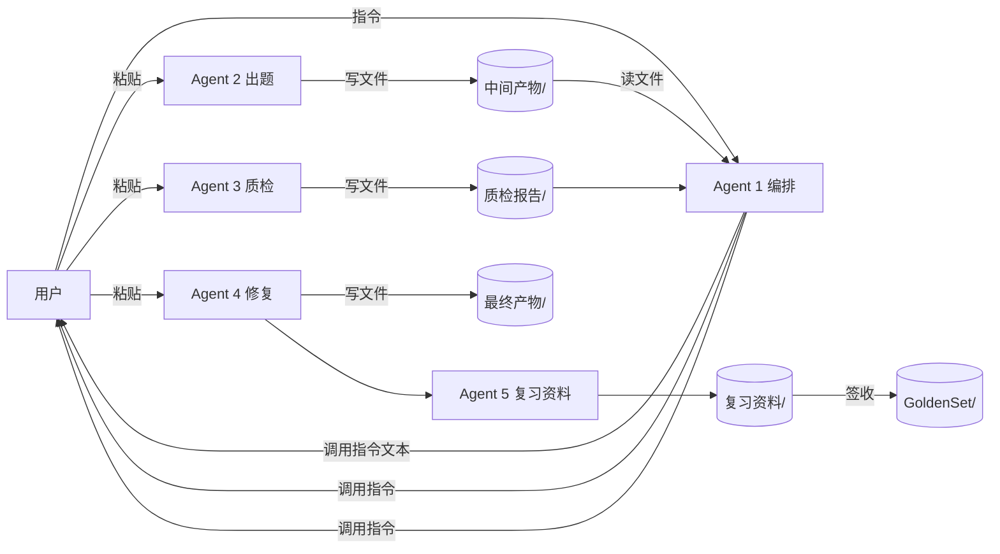
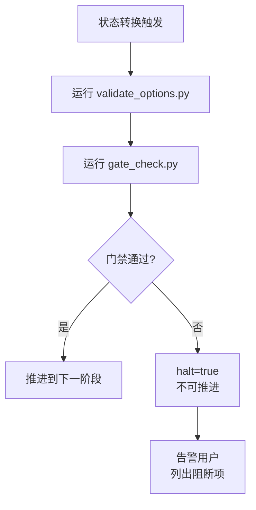
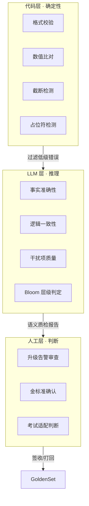
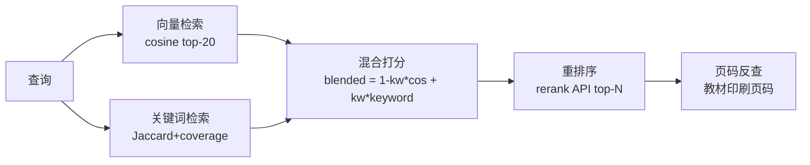

# MedAgentWork — 把 LLM 关进质量管线：医学题库工程的思路与方法论

> **版本**：v1.0　|　**日期**：2026-08-09　|　**定位**：技术分享 / 工程方法论提炼  
> **读者**：对 LLM 多 Agent 工程、防御性编排、RAG 质量治理感兴趣的开发者  
> **配套文档**：`MedAgentWork_架构演进与技术分享_v3.0.md`（系统全貌与事件复盘）

---

## 〇、这份文档讲什么

市面上不缺「我用 LLM 做了 X」的故事，缺的是「我在 X 上摔了 25 次，每一次摔出来的规则长什么样、为什么这样长」的工程记录。

MedAgentWork 是一个把临床医学教材转成结构化题库的多 Agent 系统：**5 个 Agent + 6 层防御 + 32 条硬约束 + 13 条机械化校验规则**，13 个批次累计产出 2,923 道题。

这份文档**不复述系统功能**，而是抽离出可迁移的工程思路：

1. 如何在「容错率为零」的领域里使用「会幻觉」的 LLM？
2. 为什么用文件系统当管线，而不是上 LangGraph？
3. 「声明式规则」为什么会系统性失效？怎么升级成「强制式」？
4. LLM 的「Prompt 阻抗不匹配」是什么？怎么对冲？
5. 代码、LLM、人——三者如何分工才不互相内耗？

每一节都遵循同一个结构：**遇到的问题 → 直觉方案 → 直觉方案为何失败 → 最终思路 → 可迁移结论**。

---

## 一、问题定义：在错误不可接受的领域使用不可靠组件

### 1.1 工程约束的四重夹击

医学题库这个场景，对工程而言是一个「极端样本」——它同时踩中四个最难处理的约束：

| 约束 | 表现 | 工程后果 |
|------|------|----------|
| **事实零容错** | 剂量错一个数量级就是医疗事故 | 不能信任 LLM 的自由生成，必须有事实锚点 |
| **格式强结构** | 题库是 JSON Schema，字段错位即下游崩溃 | 产出必须通过 schema 校验，不能是「近似正确」 |
| **规模化需求** | 5 学科 × 12 模块 × 数百考点 | 纯人工不可能完成，必须 LLM 批量生产 |
| **可追溯性** | 每道题要知道依据哪本教材第几页 | 全链路必须带溯源元数据，不能是黑盒 |

**矛盾的核心**：你需要一个「会犯错」的组件（LLM）去完成一个「不能犯错」的任务（医学命题）。

这个矛盾无法靠「写一个更好的 Prompt」解决——因为幻觉是 LLM 的内生属性，不是 Prompt bug。它必须靠**架构**解决。

### 1.2 核心工程命题

> **如何用架构而非 Prompt，把 LLM 的不可靠性约束在可控范围内？**

这是整份文档的主线。后续每一节都是对这个命题的某一面回答。

---

## 二、架构决策：文件系统即管线

### 2.1 直觉方案与失败

要做多 Agent 协作，社区的标准答案是 **LangGraph / AutoGen / CrewAI**：定义节点、边、状态通道，Agent 间通过内存传递消息。

我们最初也考虑过这条路。但在医学场景下，它有三个隐藏代价：

| 隐性代价 | 说明 |
|---------|------|
| **状态黑盒** | 框架把状态藏在内存对象里，出问题时无法用肉眼看「Agent 3 到底看到了什么输入」 |
| **不可打断** | 框架驱动的自动流转，难以在任意节点暂停让医学专家审查 |
| **运维负担** | 多一个框架依赖 = 多一个会坏的东西，在受限网络环境尤其致命 |

### 2.2 最终思路：把管线拍扁到文件系统

**不引入任何编排框架**。Agent 之间不直接通信，而是通过共享文件系统交接：



每个目录就是一个「阶段」的产物落地：

```
输入素材/   ← 教材原文（用户放入）
中间产物/   ← Agent 2 产出（题库 JSON + 备考资料）
质检报告/   ← Agent 3 产出（JSON 质检报告）
最终产物/   ← Agent 4 产出（修复后题库 + 追溯日志）
复习资料/   ← Agent 5 产出（主复习手册 MD）
GoldenSet/  ← 用户签收的金标准（Agent 不可写！）
```

### 2.3 这个决策带来的四个红利

**① 全链路可审计**  
任何一道题出了问题，可以沿「中间产物 → 质检报告 → 最终产物 → 追溯日志」回溯到具体哪一步、改了什么、依据是什么。框架内存对象做不到这点。

**② 人在回路的天然插入点**  
因为每次交接都是「用户把指令从 Agent 1 粘贴到 Agent 2」，用户可以在任意一次粘贴前停下来审查。医学场景需要这个——不是所有判断都能自动化。

**③ 模型异构零成本**  
Agent 2 用 qwen3.7-max 批量生产（便宜、长上下文），Agent 3 用 Claude 精细质检（推理强）。文件系统交接意味着 Agent 间无需共享运行时，**每个 Agent 可以跑在最适合自己的模型上**。这是框架方案很难做到的——大多数框架假设节点同构。

**④ 状态机显式化**  
状态不在某个对象的字段里，而在一个明文 JSON 里：

```json
// workflow_state.json
{
  "active_batch": "batch015",
  "state": "AGENT3_DONE",
  "steps": {"AGENT2": true, "AGENT3": true, "AGENT4": false}
}
```

编排器（Agent 1）每次只需读这个文件就能判断「现在该干什么」，用户说「继续」时也能自动恢复——这本质上是把 **checkpoint recovery 做成了文件系统原语**。

### 2.4 可迁移结论

> **当一个管线需要「可审计、可打断、节点异构」时，文件系统 + 显式状态机 往往优于编排框架。**  
> 框架优化的是「自动流转的效率」；文件系统优化的是「出问题时人类能介入的能力」。在错误代价高的领域，后者更重要。

代价是什么？**吞吐量低**（人工粘贴是瓶颈）、**实时性差**。但医学命题场景 neither 需要高吞吐 nor 需要实时——它需要可靠。这是典型的「用延迟换可控性」的权衡。

---

## 三、防御性工程：从「声明式」到「强制式」

这是整个项目最核心的工程教训。

### 3.1 直觉方案：写规则文档

我们最初的做法是写一份详尽的 `SOUL.md`，里面列出所有 Agent 必须遵守的规则：产出前要跑校验、B1 型题要专项检查、补丁要溯源……总共 32 条硬约束。

**直觉上这够了**——规则写得清清楚楚，Agent 应该会遵守。

### 3.2 直觉方案为何系统性失效

实际跑下来，25 起事故里有 5 起是同一种类型：**管线绕过**。

| 批次 | 绕过事件 | 规则其实写了 |
|------|---------|-------------|
| batch006 | Agent 2 没跑校验就交付 | 「产出前必须 validate」✅ 写了 |
| batch005 | B1 题型 D20=0 但仍判 PASS_WITH_FIXES | 「D20=0 必须 BLOCKED」✅ 写了 |
| batch014 | 补丁只打到聚合文件，源文件未改 | 「补丁必须溯源」✅ 写了 |
| batch011 | Bloom 记忆层 54.1% 未被阻断 | 「Bloom 偏差>15% 阻断」✅ 写了 |

**根因诊断**：规则是**声明式的**（"应该做 X"），但执行是**劝导式的**（"请做 X"）。LLM 理解了规则，却在生成压力下「忘记」或「选择性跳过」。没有任何架构级机制阻止它跳过。

这不是 LLM 不听话——这是**系统设计给了它跳过的自由**。

### 3.3 最终思路：Orchestrator-as-Enforcer

把编排器从「善意提醒者」升级为「强制门禁执行器」。关键转变是：**规则不再写在「Agent 应该读的文档」里，而是写在「Agent 无法绕过的代码」里**。



代码层（简化示意）：

```python
# gate_check.py 核心逻辑（简化）
def check_transition(batch_id, from_state, to_state):
    report = validate_options.run(batch_id)          # 机械化校验
    gates = {
        "options_pass":   report.r_fail == 0,         # R1-R13 无 FAIL
        "bloom_pass":     abs(report.bloom_deviation) <= 0.15,
        "d20_pass":       report.d20_score > 0 if has_b1 else True,
        "traceability":   report.source_coverage >= 0.9,
    }
    if not all(gates.values()):
        return {"halt": True, "blocked_gates": [k for k,v in gates.items() if not v]}
    return {"halt": False}
```

**关键设计**：Agent 1 在每次状态转换前**必须**调用这个检查。halt=true 时，编排器自己也无法推进——它不是「选择不推进」，而是「无法推进」。这就是从劝导到强制的本质区别。

### 3.4 六层纵深防御

单一门禁还不够，因为 LLM 幻觉的形态太多。我们堆叠了六层，每一层捕获上一层漏过的：

```
层1  SOUL.md 共享约束        32 条声明式规则        ← 给 LLM 看，提供「应该做什么」
层2  validate_options.py     13 条机械化检测 R1-R13  ← 给代码看，捕获格式/截断/线索
层3  save.py + ingest.py     管线顺序锁 + 防覆盖     ← 给文件系统看，捕获阶段错乱
层4  gate_check.py            4 门禁 + halt 信号     ← 给编排器看，强制阻断
层5  healthcheck.py           7 维度 127 项巡检      ← 给系统看，捕获状态漂移
层6  maintenance.py           6 任务定时维护         ← 给时间看，捕获腐化
```

**纵深防御的精髓不是「层数多」，而是「每一层的失效模式不同」**：
- 层1 失效因为 LLM 不遵守文本规则 → 层2 用代码兜底
- 层2 失效因为它只看格式不看语义 → 层4 的 Bloom/D20 门禁补语义
- 层4 失效因为状态文件可能撒谎 → 层5 巡检对比「状态说有」vs「磁盘真有」

不同失效模式 = 不会同因失效。这是比「堆更多 Prompt」高明得多的可靠性工程。

### 3.5 可迁移结论

> **声明式规则是必要的，但永远不够。任何「Agent 应该做 X」的规则，都必须配套一个「不做 X 就无法继续」的代码机制。**  
> 否则你只是在向 LLM 求情，而不是在工程化。

判断你的规则是否「强制式」的简单测试：

> *如果 LLM 完全无视这条规则，系统会在哪一行代码处停下来？*

如果答案是「不会停，只是质量变差」——那它就是声明式的，迟早会被绕过。

---

## 四、LLM 工程的阻抗不匹配

这是项目里最具启发性的一组失败。

### 4.1 一个反复摇摆的参数

我们要约束选项长度（5 个选项不能长短悬殊）。直觉方案是给 LLM 一个字数范围：

```
❌ Prompt: 「每个选项 4-12 字，长度比 ≤1.5x」
```

接下来三个批次的真实结果：

| 批次 | Prompt 调整 | 实际产出 |
|------|------------|---------|
| batch007 v1 | 「4-12 字」 | 平均 **3.9 字**（不足执行） |
| batch007 v2 | 加「≥8 字，不足则附加释义」 | 平均 **18.9 字**（过度执行） |
| batch009→010 | 反复调参数 | 在 3.9 ↔ 18.9 之间**振荡** |

### 4.2 失败的物理学

这不是 Prompt 写得不好。这是一个**阻抗不匹配**问题：

- **指令侧**：自然语言的字数约束是模糊的（「8-15 字」到底是 8 还是 15？）
- **执行侧**：LLM 的注意力机制对「数字」的响应是**触发式**的——它要么忽略数字，要么被数字绑架而矫枉过正

LLM 不擅长做「精确计数后调整」这类序列操作，因为它的本质是并行模式匹配，不是串行算法。你让它数字数，它就会过度补偿。

### 4.3 最终思路：换一种语言

不要让 LLM 做它不擅长的事（精确计数），让它做它擅长的事（模式匹配）。

```
✅ Prompt: 「5 个选项共享同一语法结构，如都是 [部位]+[疾病名]，
           或都是 [数字]+[单位]。结构一致即可，不要求字数一致。」
```

效果：选项长度自然收敛到 4-12 字区间，无需任何字数指令。原因——**LLM 理解「结构模板」远强于理解「字数范围」**。结构是模式，字数是计数；模式匹配是 LLM 的强项。

配套的修复原则也随之改变：

```
❌ 旧修复：text[:n] 暴力截断长选项     → 产生语义残片（"LVEF大于等于"丢了"40%"）
✅ 新修复：让 LLM 做语义压缩/扩充       → 信息保留，长度自然平衡
```

并用代码做兜底检测（不修复，只标记）：

```python
# validate_options.py R2 简化
def check_length_ratio(options):
    lengths = [len(o.text) for o in options]
    ratio = max(lengths) / max(min(lengths), 1)
    if ratio > 2.0:  return FAIL("选项长度比过大，疑似跨类别混用")
    if ratio > 1.5:  return WARN("建议检查结构一致性")
```

注意 R2 还做了**语义豁免**：「延髓(2字) vs Wallenberg综合征(7字)」都是解剖实体名，结构性豁免；「阿司匹林(3字) vs 抑制COX减少TXA2生成(13字)」是药物 vs 机制，真违规。检测要区分，不能一刀切。

### 4.4 可迁移结论

> **当你发现一个 Prompt 参数反复振荡，先别调参数——换一种 LLM 更容易理解的表征。**  
> 计数类约束 → 改成结构类约束；范围类约束 → 改成模板类约束；否定式约束 → 改成肯定式约束。

更一般的原则：**让 LLM 做语义操作，让代码做字符操作**。任何「让 LLM 精确计数/截断/排序」的需求，都是阻抗不匹配的信号。LLM 擅长的是「理解 → 提取 → 重述」，不是「计数 → 截断 → 对齐」。

判断测试：

> *这个任务是在做模式匹配，还是在做序列算法？*  
> 前者交给 LLM，后者交给代码。

---

## 五、代码 × LLM × 人：三元分工

### 5.1 直觉方案：让 LLM 包办

最早的 batch003 用一个 Agent 同时出题、自检、自修。结果 301 题被要求全部重做。

失败原因不是 LLM 不够聪明，而是**它对自己产物的批判距离为零**。让一个生成者审查自己的输出，等于让被告自己判案。

### 5.2 直觉方案的第二个版本：让代码包办

那把所有检查都写成代码？也不行。代码能检测「选项是否截断」（模式匹配），但检测不了「这个干扰项是否在临床上具有迷惑性」（语义判断）。机械规则会漏掉所有需要医学知识的问题。

### 5.3 最终思路：按能力边界分工

三类「执行体」各有不可替代的能力边界：



| 层 | 能力 | 不可替代的场景 |
|----|------|---------------|
| **代码** | 确定性、零幻觉、100% 可重复 | 「这个选项是否被截断了」「数值是否带单位」 |
| **LLM** | 语义理解、多步推理、开放判断 | 「这个干扰项是否具有临床迷惑性」「Bloom 层级是否达标」 |
| **人** | 价值判断、伦理判断、最终决策 | 「这道题是否适合大三学生」「金标准是否成立」 |

**关键设计**：代码层在前，LLM 层在中，人工在后。

- 代码层先过滤掉所有「低级错误」（截断、缺单位、长度悬殊），**不让 LLM 浪费 token 去判断这些**。
- LLM 层只处理代码处理不了的语义问题，产出结构化质检报告。
- 人工只看 LLM 标红的「升级告警项」，不被淹没在格式问题里。

这是「漏斗式分工」：每一层只处理上一层漏过来的、且自己擅长的问题。

### 5.4 分离原则的工程落地

「分工」要落到架构上，否则只是口号。我们的落地是**物理隔离**——每个 Agent 只读写自己负责的目录，互不越界：

```
Agent 2 → 只出题，不自检   （只写 中间产物/）
Agent 3 → 只质检，不出题不改题 （只写 质检报告/）
Agent 4 → 只执行结构化修改，不自创 （只写 最终产物/ + 追溯日志）
Agent 1 → 只编排，不自产不自审不自修
Agent 5 → 只综合复习资料
```

这个隔离用文件系统权限级别的语义实现：`save.py` 和 `ingest.py` 内置了**阶段顺序锁**——前置阶段产出不存在时拒绝入库，检测到调用指令文本时拒绝保存（防止误把指令当产出），GoldenSet 目录任何脚本拒绝写入。

> Agent 之间不是靠「自觉」分工，而是靠「物理上无法越界」分工。

### 5.5 可迁移结论

> **不要让一个组件包揽生成 + 审查 + 修复——这是结构性利益冲突。**  
> 生成者天然缺乏对自己产物的批判距离。分工必须落到物理隔离（不同的 Agent、不同的目录、不同的模型），而不是「同一个 Agent 戴不同的帽子」。

判断测试：

> *审查这个产物的组件，和生成它的组件，是不是同一个上下文？*  
> 如果是，审查就是假的。

---

## 六、失败驱动的设计方法论

### 6.1 规则不是设计出来的，是摔出来的

这个项目最反直觉的一点：**32 条硬约束里，没有一条是预先设计的**。每一条都对应一次具体事故。

| 规则 | 事故 | 事故形态 |
|------|------|---------|
| HC-5 数值抽查 | 题25 事件 | 外来素材数值未核对教材 |
| HC-6 干扰项区分度 | 题245 事件 | 干扰项与正确值差 5 倍，一眼假 |
| R7 截断检测 | batch006 | 272 题 `text[:n]` 残片 |
| R8 最小长度 | batch007 | 96 题以「的/和/与」结尾 |
| HC-13 补丁溯源 | batch014 | 补丁只打聚合文件，源文件回归 |
| Bloom 门禁 | batch011 | 记忆层 54.1%，全题库变背诵题 |
| HC-14 结构模板 | batch007-010 | 选项长度 3 次振荡 |

**规则的存在 ≠ 规则的生效**。很多规则在事故前就已经写进 SOUL.md 了，但仍然被绕过——直到配上代码强制机制才真正生效。这印证了第三节的核心论点：声明式规则不够。

### 6.2 事故分类学：四类系统性缺陷

25 起事故做根因分析后，归入四个系统性缺陷。这个分类本身是可迁移的工具——它帮助你不停留在「修这个 bug」，而上升到「修这类 bug 的温床」：

| 缺陷 | 本质 | 占比 | 解药 |
|------|------|:--:|------|
| **A. 声明式规则** | 写了规则但无强制执行 | 5 起 | Orchestrator-as-Enforcer（第三节） |
| **B. Prompt 阻抗不匹配** | 自然语言约束被过度/不足执行 | 4 起 | 结构模板替代参数（第四节） |
| **C. 状态-文件系统漂移** | 状态记录与磁盘实际不一致 | 6 起 | healthcheck 巡检自动化 |
| **D. 零自动化运维** | 所有维护靠「记得就做」 | 10 起 | maintenance.py 定时任务 |

**A 和 B 是「设计层」缺陷**——规则形态本身有问题。  
**C 和 D 是「运维层」缺陷**——规则是对的，但没人持续执行。

这两类需要不同的解药：设计层靠「换表征 + 强制执行」，运维层靠「自动化 + 定时触发」。

### 6.3 自动化的三层模型

针对缺陷 D（零自动化运维），我们部署了三层自动化：

```
Layer 1: 事件触发 — 每次 Agent 状态转换 → 自动跑 gate_check.py
Layer 2: 定时巡检 — cron 驱动 → maintenance.py 跑 6 个维护任务
Layer 3: 版本管理 — Prompt 快照 + MD5 注册表，任何 Prompt 改动可回滚
```

关键认知：**「记得就做」=「不会做」**。人类记忆不是可靠的调度器。任何依赖「下次记得跑一下校验」的运维，最终都会演变成「下次忘了跑，于是事故发生了」。

把「记得做」变成「自动做」，把「自动做」变成「不做就停」，是运维可靠性的三级跳。

### 6.4 可迁移结论

> **每一起事故都是一条规则的胚胎。但要让规则真正生效，必须给它配一个「不做就无法继续」的代码机制 + 一个「自动触发」的运维钩子。**  
> 否则事故会以不同形态重复发生——因为根因（声明式 + 人工触发）没变。

落地清单（任何 LLM 工程项目可直接套用）：

1. **建立事故登记表**——每次质量问题记录：现象、根因、缺陷分类、对应规则
2. **每条规则配套代码强制点**——找到「不做就无法继续」的那行代码
3. **规则触发自动化**——事件触发（状态转换）+ 定时触发（巡检）
4. **定期根因聚类**——把单点事故归入系统性缺陷，修温床而非修伤口

---

## 七、知识库：让事实有锚点

前面讲的都是「约束 LLM 别出错」。但医学命题还需要一个正面能力：**让 LLM 知道正确的事实是什么**。

### 7.1 问题：LLM 的医学知识是「统计记忆」

LLM 见过很多医学教材，但它的知识是**模糊的统计印象**——它「大概记得」心衰的 LVEF 阈值是 40% 或 45% 或 50%，但在命题时无法确定。在医学场景，这种模糊就是错误。

### 7.2 思路：RAG 提供事实锚点，但 RAG 不能一刀切

标准 RAG 解决方案：把教材嵌入向量库，出题前检索相关片段作为事实依据。这没问题，但**不同学科的检索特性差异巨大**：

| 学科 | 检索特性 | 适合的 keyword_weight |
|------|---------|:--:|
| 中医学 | 术语高度特化（"四君子汤"必须精确命中） | **0.6** |
| 神经病学 | 解剖定位词需精确匹配 | **0.5** |
| 外科学 | 术式名称关键词重要 | 0.4 |
| 内科学 | 临床表现语义为主 | 0.3 |
| 皮肤性病学 | 纯语义检索（皮损描述难精确） | **0.0** |

一刀切的 keyword_weight 会让中医学漏检关键方剂，或让皮肤科被关键词噪声淹没。所以每个学科有独立配置：

```json
// configs/tcm_config.json
{
  "chunk_strategy": {"chunk_size": 500, "overlap": 50},
  "retrieval_strategy": {"top_n": 5, "keyword_weight": 0.6},
  "semantic_protection": ["方剂名", "中药名", "穴位名"]
}
```

### 7.3 两阶段混合检索



**两个工程细节值得强调**：

1. **页码反查**：医学题库要求每题标注教材页码，所以检索结果必须带页码元数据。但向量分块后页码会丢——我们用 `chunks_metadata.jsonl` 保留每个分块的源页码，检索后反查。
2. **索引快照**：每个学科索引时保存配置快照 `index_config.json`，检索时对比当前配置——如果配置变了但索引没重建，会警告「配置-索引不一致」。这避免了「静默用旧索引」的隐患。

### 7.4 可迁移结论

> **RAG 的质量不在「检索算法多先进」，而在「分块策略、检索参数、元数据保留是否按数据特性定制」。**  
> 一刀切 RAG 在专业领域会失败——因为不同子领域的术语密度、精确度需求、语义模糊度完全不同。

落地清单：

1. 为每个学科/领域单独配置 chunk_size + keyword_weight
2. 保留分块元数据（页码、章节），支持检索后反查
3. 索引快照 + 配置一致性检查，防静默漂移
4. 配置损坏时容错降级到默认参数，不中断检索

---

## 八、可迁移的工程清单

把前七节浓缩成一份任何 LLM 工程项目可套用的清单：

### 架构层

- [ ] **文件系统即管线**：当需要可审计/可打断/节点异构时，用文件 + 显式状态机，不上框架
- [ ] **物理隔离分工**：生成、审查、修复分属不同 Agent / 不同上下文 / 不同目录
- [ ] **模型异构**：批量生产用便宜模型，精细质检用强推理模型，靠文件交接解耦

### 防御层

- [ ] **每条声明式规则配一个代码强制点**（「不做就无法继续」的那行代码）
- [ ] **纵深防御按失效模式分层**，而非按检查项堆叠（层间不同因失效）
- [ ] **Orchestrator-as-Enforcer**：编排器在状态转换前强制跑校验，halt=true 则自己也无法推进

### LLM 交互层

- [ ] **让 LLM 做语义操作，让代码做字符操作**（计数/截断/排序交给代码）
- [ ] **振荡参数换表征**：字数约束 → 结构模板；范围 → 模板；否定 → 肯定
- [ ] **代码先过滤低级错误**，LLM 只处理语义问题，人工只看 LLM 标红的告警

### 运维层

- [ ] **事件触发 + 定时触发 + 版本快照** 三层自动化
- [ ] **「记得就做」=「不会做」**：把人工触发改成自动钩子
- [ ] **事故登记 + 根因聚类**：修系统性缺陷的温床，不修单点伤口

### 知识库层

- [ ] **分领域定制 RAG 配置**（chunk_size / keyword_weight / 语义保护词）
- [ ] **保留分块元数据**支持反查（页码、章节、来源）
- [ ] **索引快照 + 配置一致性检查**，防静默漂移

---

## 九、几个反直觉的结论

最后总结这套工程思路里最反直觉的几点——它们往往与「直觉工程」相反：

1. **更好的 Prompt 不是答案，更好的架构才是。**  
   当 LLM 不可靠时，解法不是「写得更详细的 Prompt」，而是「设计 LLM 即使不可靠也无法造成伤害的管线」。

2. **规则写得再清楚，不如让规则无法被跳过。**  
   声明式规则给人看，强制式机制给系统看。前者解决「知不知道」，后者解决「做不做」。

3. **让 LLM 做它不擅长的事，是大多数失败的根源。**  
   LLM 不擅长精确计数、字符截断、序列对齐——把这些交给代码，LLM 只做语义。

4. **生成者和审查者必须是物理隔离的两个上下文。**  
   否则审查就是自我安慰。

5. **「记得就做」等于「不会做」。**  
   任何依赖人工记忆触发的运维，最终都会失效。自动化不是效率优化，是可靠性必需。

6. **每一起事故都是一条规则的胚胎，但胚胎需要代码强制 + 自动触发才能长大。**  
   否则事故会换件衣服再来一次。

---

## 核心论点

> 在错误不可接受的领域使用 LLM，关键不是「让 LLM 变可靠」（它不会），而是「**设计一个 LLM 即使不可靠也无法产出错误结果**的管线」。  
> 这个管线由三层构成：**LLM 负责语义生成、代码负责确定性校验、人负责价值判断**——三者按能力边界物理隔离、漏斗式分工、纵深防御。  
> 每一道锁、每一条规则、每一层自动化，都不是预先设计的，而是从一次失败中生长出来的。**失败驱动设计，强制保证执行，自动化维持运转**——这三句话，就是这套工程的全部思路。

---

*本文档由 MedAgentWork Agent 1 (MedMaster) 撰写。方法论提炼自 13 个批次、2,923 道题、25 起已记录事故的工程实践。配套系统全貌见 `MedAgentWork_架构演进与技术分享_v3.0.md`。*
